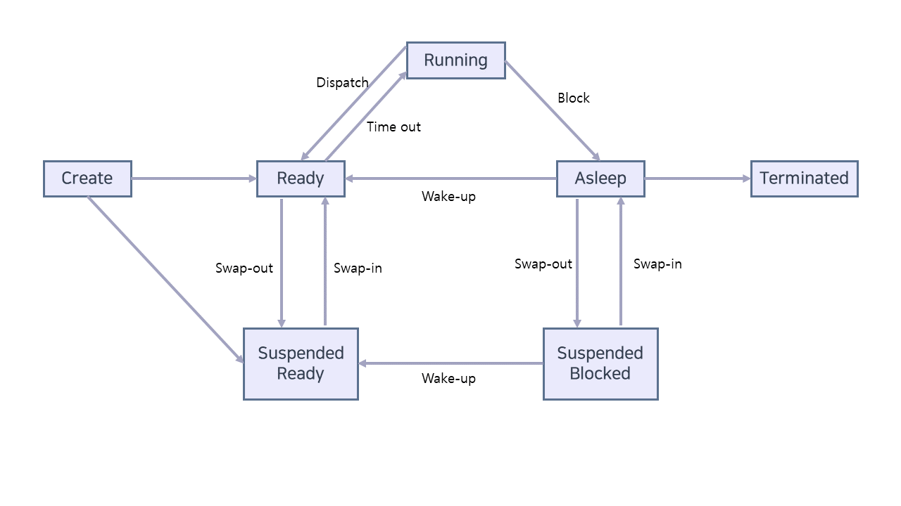

# 01 프로세스의 개념
프로세스란 CPU가 하는 작업들을 뜻한다.
***

## 프로세스(The Process)
* 프로세스는 스택, 데이터 섹션, 힙을 포함한다.
* 프로그램은 누가 실행시켜줘야 한다.
* 프로세스는 스스로 다음에 실행할 명령어를 지정한다.
* 실행 파일이 메모리에 올라가면 프로그램은 비로소 프로세스가 된다.
## 프로세스 상태(Process State)
* 프로세스는 매번 상태가 변한다.
* 프로세스 상태 전이도

    * Create : 프로세스 생성중
    * Running : 명령어가 실행중
    * Asleep : 프로세스가 대기중
    * Ready : 프로세스가 CPU할당을 기다림
    * Terminated : 프로세스 종료

## 프로세스 제어 블록(Process Control Block, PCB)
* PCB에는 프로세스와 관련된 정보를 저장한다.
    * 프로세스 상태
    * 프로그램 카운터 : 다음 실행할 명령어를 가리킴
    * CPU 레지스터들
    * CPU 스케줄링 정보 : 우선순위 등 스케줄 변수
    * 메모리 관리 정보 : 사용하는 메모리의 범위
    * Accounting 정보 : CPU 사용 시간, 시간 제한, 프로세스 번호 등
    * 입출력 상태 정보 : 프로세스에 할당된 입출력 장치들 

## 스레드(Threads)
* 프로세스의 확장 개념이다.
* 하나의 프로세스에 여러 스레드가 존재할 수 있다.
